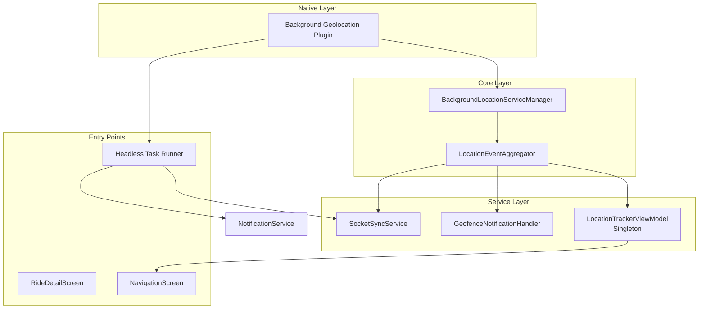
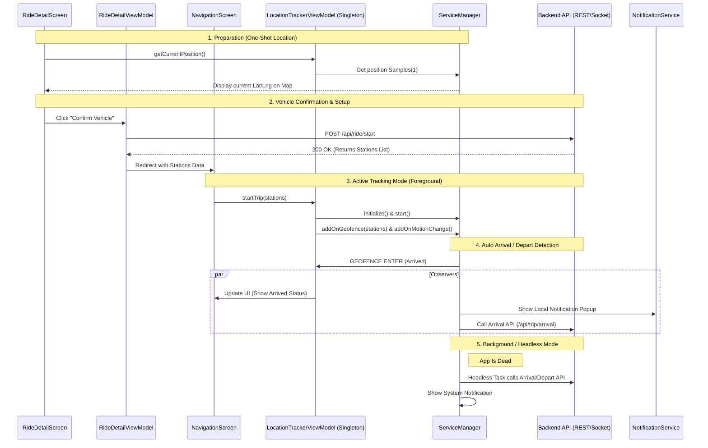
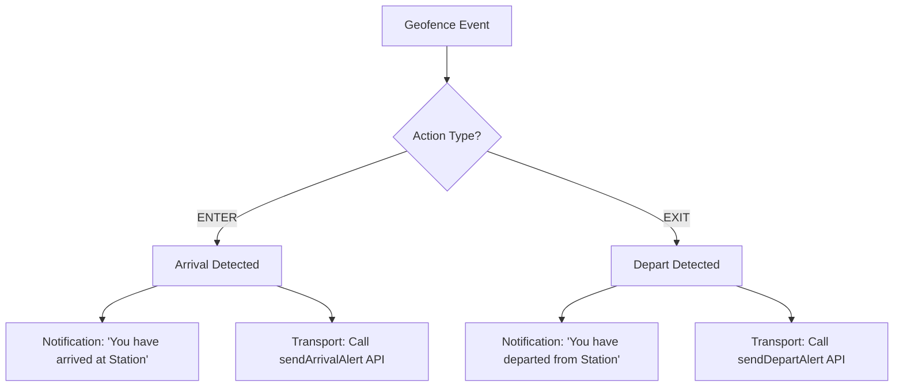
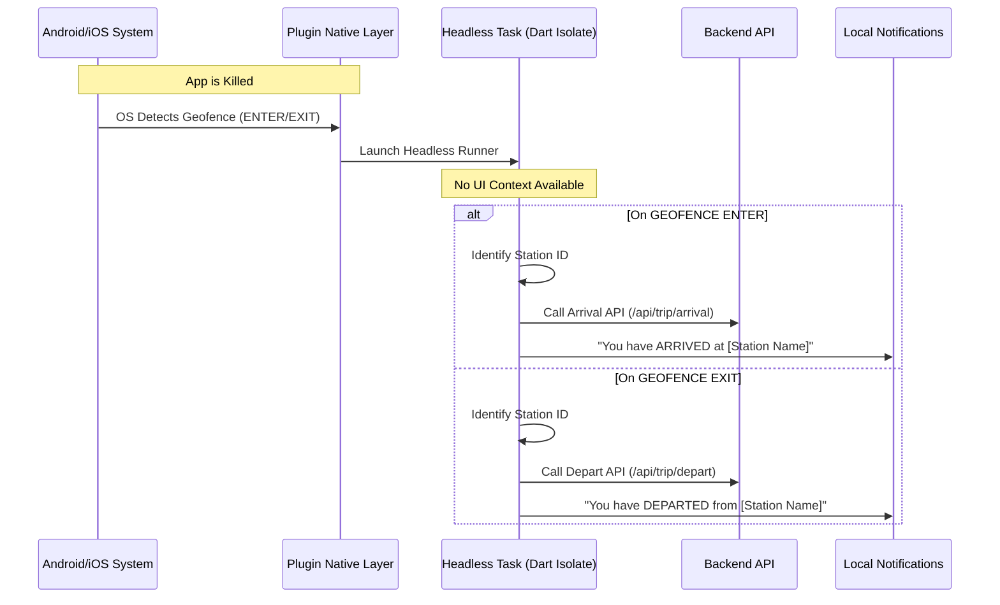
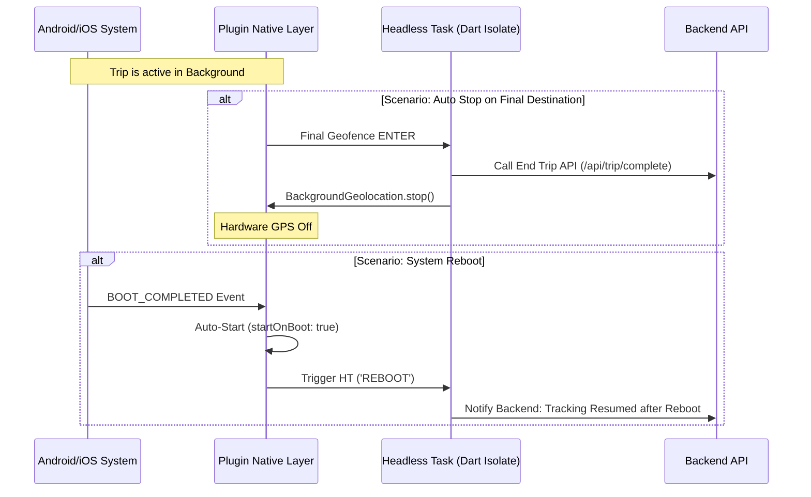

# Background Location Tracker - Project Documentation

## 1. Overview
The `bg_location_tracker` package is a high-performance background tracking and geofencing engine for the Captain App. It ensures the backend and the Captain are always synchronized with the real-time state of a trip, even when the application is terminated or the phone is in a pocket.

---

## 2. System Architecture (Module Interaction)
The project is built on a "Reactive Observer" architecture. The **Service Manager** emits raw events, which are aggregated and then observed by multiple independent modules.



---

## 3. Lifecycle Sequence Diagram: From Ride Detail to Navigation
This diagram shows the complete flow: from one-shot location in Ride Details, to starting a ride via API, and finally activating background geofencing in Navigation.



---

## 4. Geofence Flow: Auto Arrival & Depart
The system handles geofencing automatically. When a Captain enters or exits a predefined diameter (station), the following logic triggers.



---

## 5. Implementation Guide

### Phase 1: Ride Detail Screen (Preparation)
Initialize the singleton but do not start the "Trip". This saves battery while providing the current location for the map.

```dart
// RideDetailViewModel logic
final lvm = LocationTrackerViewModel();
final currentPos = await lvm.getCurrentPosition();

// On Confirm Vehicle
final stations = await api.startRide(rideId);
Navigator.push(context, NavigationScreen(stations: stations));
```

### Phase 2: Navigation Screen (Active Tracking)
This starts the background powerhouse. It enables:
- **Motion Change**: High-frequency updates only when moving.
- **Geofences**: Triggers Arrival/Depart status.
- **Socket Sync**: Real-time position on your dashboard.

```dart
// NavigationScreen logic
@override
void initState() {
  super.initState();
  LocationTrackerViewModel().startTrip(
    stations: widget.stations,
    captainId: captainId,
    rideId: rideId
  );
}
```

### Phase 3: Global Headless Setup (`main.dart`)
Must be registered at the root to handle events when the app is NOT running.

```dart
@pragma('vm:entry-point')
void backgroundGeolocationHeadlessTask(bg.HeadlessEvent event) async {
  if (event.name == bg.Event.GEOFENCE) {
    // Call Arrival/Depart APIs directly from transport
  }
}
```

---

## 7. Headless Task Deep Dive (App Killed State)
When the application is in a **Killed State** (removed from recent apps or terminated by OS), the Dart UI code is not running. However, the Native Plugin continues to operate and executes the `Headless Task` isolate.

### A. Headless Arrival & Depart Flow (Killed State)
This diagram shows how the system handles station logic when the user is NOT inside the app.



### B. Headless Ride State Management (Stop/Resume)
How the tracking lifecycle finishes or persists across phone reboots in a killed state.



---

## 8. API Integration Checklist
To complete the **Auto Arrival/Depart** setup, ensure your backend implementation handles these specific endpoints:

| Event | Action Name | Logic Flow | Endpoint Example |
| :--- | :--- | :--- | :--- |
| **GEOFENCE ENTER** | Arrival | Triggered by SM -> SYNC | `/api/trip/arrival` |
| **GEOFENCE EXIT** | Depart | Triggered by SM -> SYNC | `/api/trip/depart` |
| **START RIDE** | Setup | Returns stations list | `/api/ride/start` |
| **LOCATION** | Tracking | Streamed via Sockets | `socket.emit('location')` |

---

## 7. Cleanup
Always ensure `stopTrip()` is called when the ride is finished to release the GPS hardware and close the socket listeners.

```dart
await viewModel.stopTrip();
```
